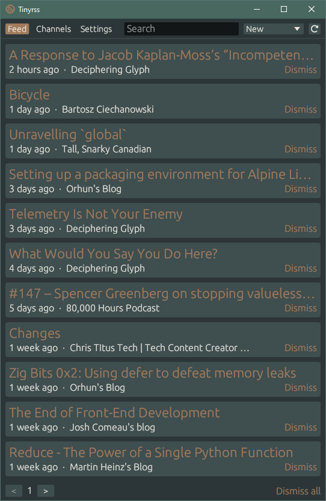
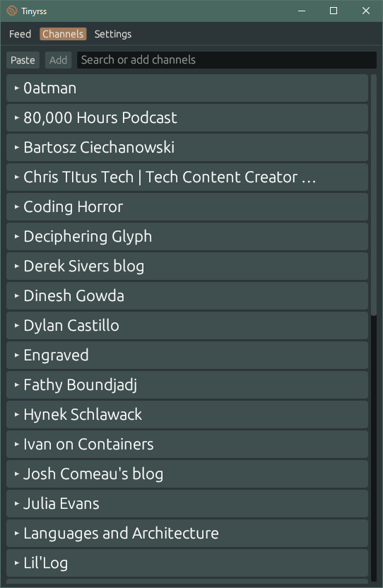

  
# Small and simple RSS aggregator

  
  &nbsp;&nbsp;&nbsp;&nbsp;&nbsp;
   

# Install

Download the [latest release](https://github.com/dbsdm/tinyrss/releases/latest)

Alternatively install from source `cargo install tinyrss`
